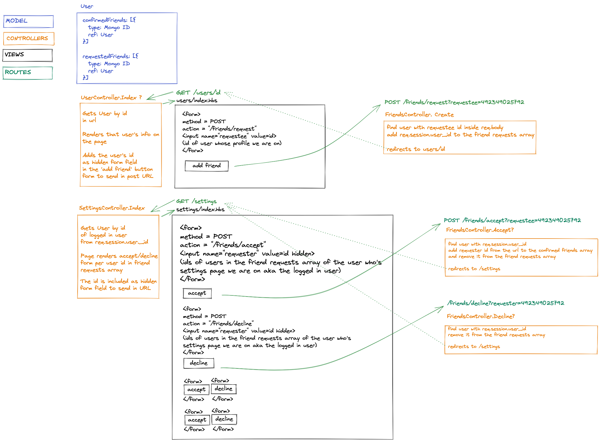

  
  
  
  
  
  
  
  
  
 

 
## Acebook

A Facebook-like social app built with Node.js, Express.js, MongoDB, Mongoose and Bootstrap.\
Tested with Jest and Cypress.

> [Try it on Heroku](https://dmeowbook.herokuapp.com/)

### Users can:
* Sign-up and log-in
* Make and view posts with images
* Like posts
* Comment on posts
* Visit other user's profiles
* Send, receive, accept and decline friend requests

## Team
[D. Dramchev](https://github.com/ddrmv) | [Jovi Lau-Kwong](https://github.com/44jovi) | [Rita Aktay](https://github.com/ritaaktay) | [Marina Ivanova](https://github.com/MarinaIvanova-1) | [Gregory Redos](https://github.com/G-Redos) | [Yichao Qian](https://github.com/oahciy)

## Unit Test Coverage

## Design

### A digaram of the friending feature request-response cycles

